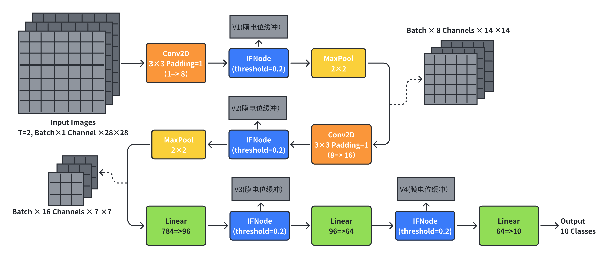

# 国科大《GPU架构与编程》大作业一：SCNN模型推理加速

## 运行命令

1. 推理并统计准确率和时间：

   ```bash
   nvcc inference.cu -o inference_prog -Xcompiler "-O3 -std=c++14" -gencode arch=compute_60,code=sm_60 -gencode arch=compute_61,code=sm_61 -gencode arch=compute_70,code=sm_70 -rdc=true
   ./inference_prog ./path/to/weight/
   ```

2. 训练模型权重参数：

    ```bash
    python scnn_train.py
    ```

## 文件说明

### scnn模型参数调整
- LEARNING_RATE = 2e-3
- T_TIMESTEPS = 2
- 模型结构调整为：
    

### 推理加速优化
1. Conv2D + IFNode 融合为一个 Kernel， Linear + IFNode 融合为一个 Kernel，减少全局内存访问次数，以及内核启动开销。
2. 全连接层的 GEMM 实现采用了共享内存分块 + 寄存器分块，减少内存访问的延迟。
   - 共享内存分块大小为 32x32x64（TILE_M, TILE_N, TILE_K），每个 thread block 计算 32x32 的输出子矩阵。
   - 寄存器分块大小为 4x2，每个线程计算 4x2 个输出元素。
3. 卷积层的 CONV2D 实现采用了共享内存分块，优化内存访问。
   - 在 HxWxCout 三个维度上进行分块，每个 thread block 计算一个 TILE_H x TILE_W x OUT_PER_BLOCK (14x14x4) 的输出子矩阵。共享内存中存放 16x16 的输入子矩阵和 3x3x4 的权重子矩阵。
4. PTX 优化：
   - 向量化内存操作：通过 v4.f32 向量指令一次性读写 4 个 float 数据，降低内存带宽消耗。
   - FMA 融合指令：使用 fma.rn.f32 替代分离的乘法和加法，减少指令数和延迟。